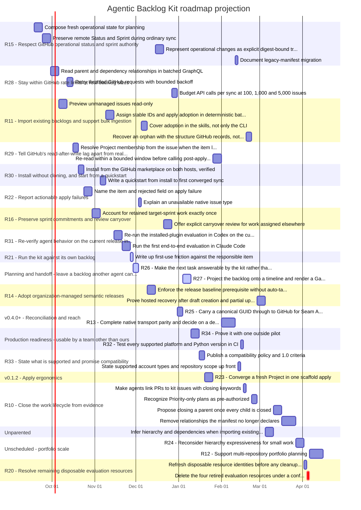

# Agentic Backlog Kit roadmap projection

**Generated. Do not edit by hand.** Regenerate with `abk gantt --lanes 1 --days-per-effort 2`.

- Projection start: `2026-09-18`
- Projected finish: `2027-04-15`
- Scheduled items: 42
- Duration basis: 2 day(s) per effort point
- Parallel lanes: 1
- Critical path: `S-R15-1 -> S-R15-2 -> S-R11-1 -> S-R11-2`

This is a **projection, not an estimate**. Durations come from effort
points multiplied by one declared factor, and order comes from the
dependencies the backlog already declares. There is no velocity history,
no assignment, and no calendar of working days behind these dates.

## Not scheduled

| Item | Why |
| --- | --- |
| `EPIC-CONT` | type 'Epic' groups work its children carry |
| `EPIC-OPS` | type 'Epic' groups work its children carry |
| `EPIC-PLAN` | type 'Epic' groups work its children carry |
| `EPIC-PROD` | type 'Epic' groups work its children carry |
| `EPIC-UNSCHED` | type 'Epic' groups work its children carry |
| `EPIC-V010` | type 'Epic' groups work its children carry |
| `EPIC-V011` | type 'Epic' groups work its children carry |
| `EPIC-V012` | type 'Epic' groups work its children carry |
| `EPIC-V020` | type 'Epic' groups work its children carry |
| `EPIC-V030` | type 'Epic' groups work its children carry |
| `EPIC-V040` | type 'Epic' groups work its children carry |
| `INIT-ABK` | type 'Initiative' groups work its children carry |
| `R01` | already complete: status 'Done' |
| `R02` | already complete: status 'Done' |
| `R03` | already complete: status 'Done' |
| `R04` | already complete: status 'Done' |
| `R05` | already complete: status 'Done' |
| `R06` | already complete: status 'Done' |
| `R07` | already complete: status 'Done' |
| `R08` | already complete: status 'Done' |
| `R09` | already complete: status 'Done' |
| `R10` | type 'Feature' groups work its children carry |
| `R11` | type 'Feature' groups work its children carry |
| `R14` | type 'Feature' groups work its children carry |
| `R15` | type 'Feature' groups work its children carry |
| `R16` | type 'Feature' groups work its children carry |
| `R17` | already complete: status 'Done' |
| `R18` | already complete: status 'Done' |
| `R19` | already complete: status 'Done' |
| `R20` | type 'Feature' groups work its children carry |
| `R21` | type 'Feature' groups work its children carry |
| `R22` | type 'Feature' groups work its children carry |
| `R28` | type 'Feature' groups work its children carry |
| `R29` | type 'Feature' groups work its children carry |
| `R30` | type 'Feature' groups work its children carry |
| `R31` | type 'Feature' groups work its children carry |
| `R33` | type 'Feature' groups work its children carry |
| `S-R21-1` | already complete: status 'Done' |
| `S-R21-2` | already complete: status 'Done' |
